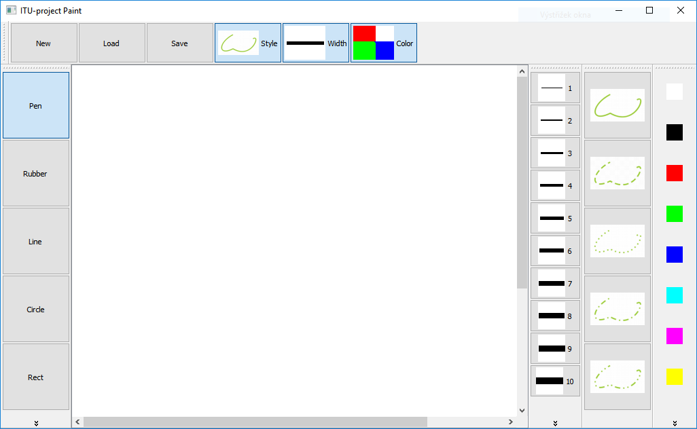
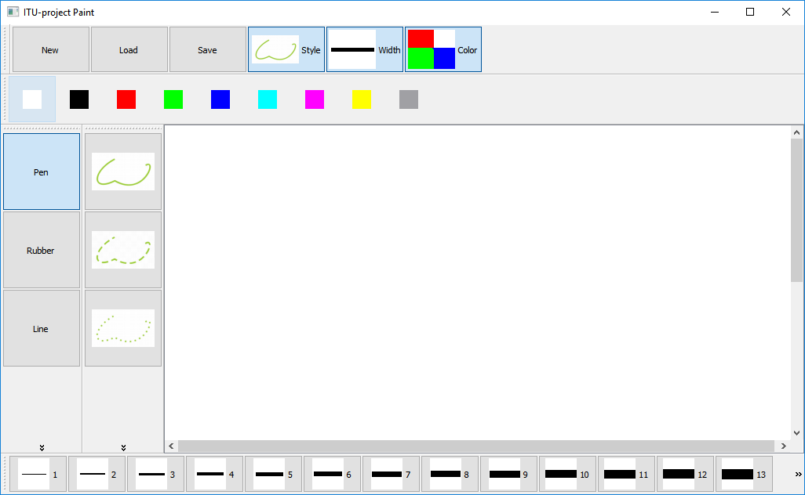
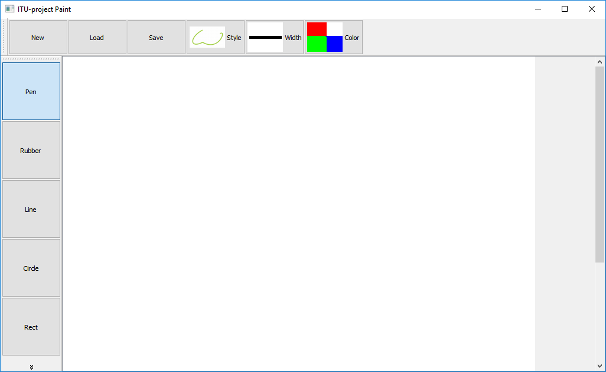
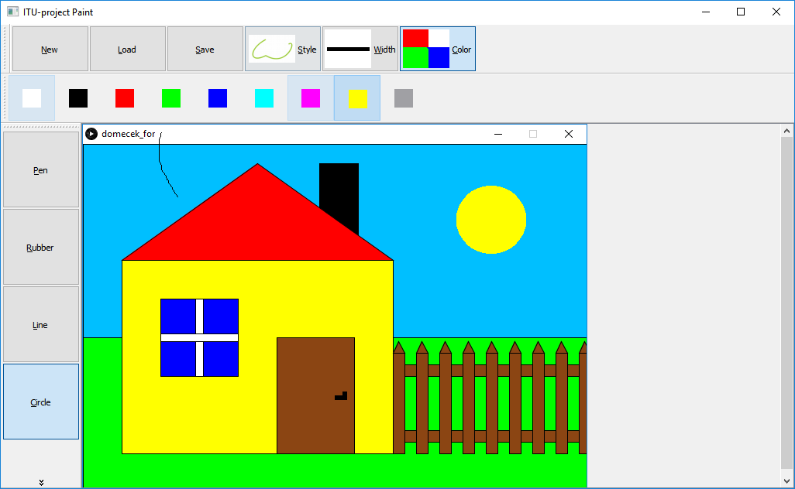

# ITU-project 2016 - Paint

Example of alternative user interface for the application like Windows Paint.

## Authors:   
Jaroslav Páral   
Andrej Masár   

## Screenshots

Default tools configuration

Users tools configuration

Without tools

App in use (drawing to picture)

## Source - similar projects
https://github.com/oakhan3/QT-Paint

https://github.com/bruceoutdoors/DrawingApp
